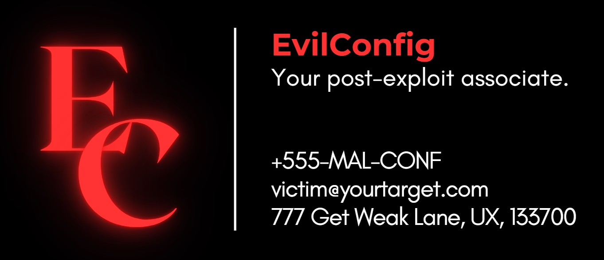

**EVILCONFIG** - A PowerShell script to quickly weaken a Windows device, with optional persistence.


## Purpose

This script can be used after initial exploitation, allowing an attacker to quickly weaken the device to assist in further exploitation, privilege escalation, or lateral movement. Applying the weaknesses in this script to a victim machine better allows the attacker to re-exploit the machine after losing initial access.

Defenders may find value in using this script to test their local security policies or domain group policies. 

## Requirements
1. This script must be run as administrator.
2. This script requires a stable internet connection if running the persistence module.

## Usage

Basic execution:
```powershell
./evilconfig.ps1
```

Optional flags:
```
--help       display help menu in the terminal
--persist    execute persistence module
--log        log successful and unsuccessful actions to a local file, configs.txt
# persist and log can be run simulataneously
```

## Demo


## Features
The current version of **EvilConfig v1.0** contains these features. 

### Defense Evasion

* ~~Disable Windows Event Logging~~ *known bug*
* Disable Firewall logging
* Disable Windows Defender
* Disable Windows Firewall (Public)
* Disable Windows Firewall (Domain)
* Disable Windows Firewall (Private)

### Weakening/Vulnerabilities

* Enable local Administrator account
* Enable local Guest account
* Disable User Access Control (UAC) [restart required to complete]
* Enable Wdigest registry key
* Enable SMBv1 [restart required to complete]
* Enable Print spooler
* Disable Windows Updates
* Set PowerShell execution policy to Unrestricted


### Persistence
This persistence module is optional and can be run with the `--persist` flag.

* Install SSH client
* Add local user (non-privileged)
* Add local user (privileged)
* Add new local users to RDP group
* Enable RDP

### Logging
This logging module is optional and can be run with the `--log` flag. <br>

This program is suppossed to be as quiet as possible. By default, no logging is printed on your screen terminal. When the `--log` flag is enacted, logging is written to a local file `configs.txt` without writing anything to your terminal screen. Logging only prints to your terminal screen if an error ocurred while trying to write to the log file. 

Only the help menu in the `--help` option prints text to your terminal screen as custom (non-interactive) text.

## Disclaimer

This tool may break things. This tool should only be executed on devices on which you have authorized permission to perform malicious actions. If using this tool in a contracted offensive engagement, review your scoping agreement and rules-of-engagement for an appropriate service downtime clause before using this tool. 

## Future Work

* Fix the bug in disabling Windows Event Logging
* Make the proccess non-interactive

